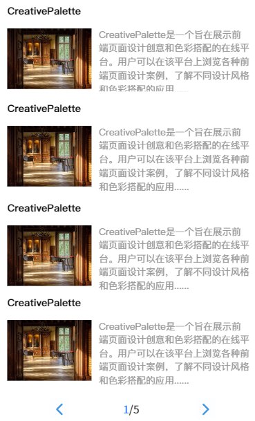
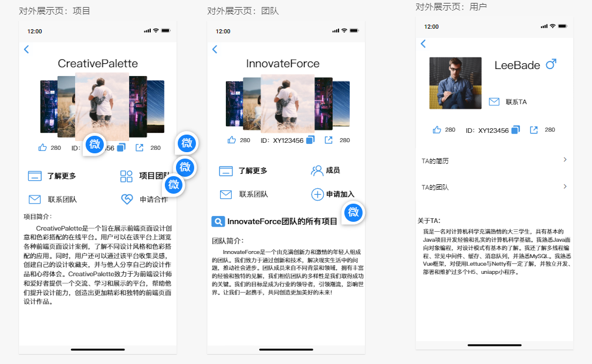
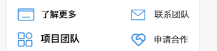
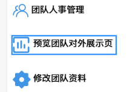
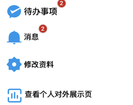
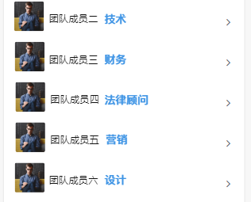
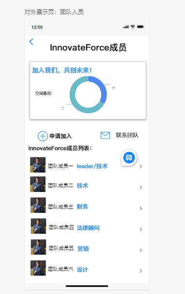

# 技术栈

后端技术栈：SpringBoot、Shiro、MyBatis、MySql

前端技术栈：uniapp、部分wx小程序接口

工具：ApiPost

# 前端概要设计

设计思路：非固定的信息都由后端提供，前端仅负责优雅地显示信息

id设计，前四个字符区分如下信息：user、item（项目）、team、file（文件）、imag（图片）、mail（邮件）、even（事件）、

## 组件设计

包装<A HREF=https://uniapp.dcloud.net.cn/component/>uniapp提供的组件</A>并生成我们自己的可复用组件
### 一级页面、对外展示页使用的组件

#### overview

接收图片、项目、团队的概要数据，并分页显示
- 效果图：
  - 
- 概要数据的相同属性名
  - 入口处：id、imageIds、name、description
  - 对外展示页：likes、shares、fileId
  - 下载图片后的临时路径存放在imagePath属性中，该属性的值是数组，该数组存放临时路径，顺序与imageIds一致
- 图片、项目、团队概要数据的不同属性名
  - 项目：teamId、leaderId
  - 用户：gender、teamIds
  - 团队：leaderId、memberIds、projectIds
- 主要函数：
  1. 根据id的前四个字符判断该概要数据是user、item还是team
  2. 跳转到对外展示页，并传入概要数据 
- 主要data：概要数据数组

```JSON
"pageSize":5,
"total":10,
"items":[
  {
        "id": "item2",
        "name": "Project 2",
        "description": "Description of Project 2",
        "filePah":"C/jjj",
        "fileId":"123",
        "imagepaths":["C/user"],
        "imageIds": ["1","2"],
        "likes": 80,
        "shares": 30,
        "teamId": "2",
        "leaderId": "2",
  },
  {..}...
]


"user":[
    {
        "id": "user2",
        "name": "Project 2",
        "description": "Description of Project 2",
        "fileId":"123",
        "imageIds": ["1","2"],
        "likes": 80,
        "shares": 30,
        "gender": 1,//注意0男1女2隐藏
        "teamIds": ["team1", "team2"],

    }
]

"team":[
    {
        "id": "team2",
        "name": "Project 2",
        "description": "Description of Project 2",
        "fileId":"123",
        "imageIds": ["1","2"],
        "likes": 80,
        "shares": 30,
        "leaderId": "leader1",
        "memberIds": ["member1", "member2", "member3"],
        "projectIds": ["project1", "project2"],
    }
]


"HR":{
    "theme":"this is a theme",
    "vacantPositions": [
        {
            "positionName": "Backend Developer",
            "vacancy": 1
        },
        {
            "positionName": "UI/UX Designer",
            "vacancy": 2
        }
    ],
    "members": [
        {
            "id": "1",
            "name": "Alice",
            "imageIds": ["image1"],
            "positionName": [
                "Backend Developer"
            ],
            "positionIndex":2
        },
        {
            "id": "2",
            "name": "Bob",
            "imageIds": ["image1"],
            "positionName": [
                "UI/UX Designer"
            ],
            "positionIndex":1
        }
    ]
}
```


#### userDetail、itemDetail、teamDetail



初始化函数
- 显示骨架图
- 接收跳转链接携带的数据存储在本地
  - 原数据是对象，将该对象的属性拆分存储
- 并行下载除第一张图片外的所有图片
- 图片准备好后取消骨架图显示数据，至少显示1秒的骨架图，即接收图片花费的时间可能小于1秒

使用的子组件
- Interaction
- Carousel
- Menu


#### interaction

点赞、ID复制选项、分享


初始化函数：
- 接收父组件传递的数据：id、likes、shares并存储在组件实例中

主要函数
- 点赞、取消点赞
- 分享，调用wx接口，此处建议使用条件编译

#### carousel

显示主题、图片


初始化函数
- 接收父组件传递的参数：name、已经下载好的图片的临时路径

#### menu








初始化函数
- 接收两个列表，每个列表由相同属性名的对象组成
- 对象属性名：name、icon、navigatefn
  - 注意这些对象很可能会复用，建议记下来维护
- 第一个列表靠左，第二个列表靠右
- 如果只有第二个列表为undefined，即没有传递，就不显示该列表
- 对象的第三个参数是用于跳转的函数，如果没有就使用undefined占位

可以采用另一种比较好实现的方法
- 列表显示菜单
  - 效果类似这样
  - 
- 每个列表的元素包括：图标、菜单名、右箭头、红底数字

#### membersAndRecruitment
 
 
 如何显示空缺职位自行决定，如果uniapp没有组件支持就直接使用文字表示
 
使用的组件
- Menu
- Members

api：获取团队的成员列表及空缺职位
#### members

初始化函数
- 接收父组件传递的参数
- 跳转时跳转到用户展示页

### Owner修改数据使用的组件

#### itemManagement、teamManagement、userManagement

尽管ItemManagement、TeamManagement界面是一样的，但是逻辑有一些差异，为了以后修改方便，建议两个组件分开写

初始化函数
- 接收跳转函数传递的参数
  - 建议使用一个参数flag判断是修改还是创建
- 创建
  - 如果是创建项目则要求传入团队id
  - 如果是创建团队则无需传入任何参数
- 修改
  - 要求传入详细信息，并且在当前修改页中显示
- 使用api：项目、团队数据修改
  - 注意提交操作是同步不可中断操作
- 有些提示信息可以优化一下，不用和墨刀上一模一样


#### hrManagement


使用api：团队人事

这个组件的逻辑比较复杂，实现的方法有很多种，建议最后做，看你们能用什么方法实现就可以用什么方法，我不多做限制，但是要求功能是不变的


## api

apipost中仅给出成功响应

http响应报文头部的code指明报文状态

http响应报文体
- code：方便你两书写逻辑
- msg：出错时或成功时给用户看的信息
- data：你请求的数据

### 示例数据设计

```JSON
{
    "code":200,
    "data":{
        "pageSize": 5,
        "total": 1,
        "items": [
            {
                "id": "item1",
                "name": "Project 1",
                "description": "Description of Project 2",
                "fileId": "123",
                "imageIds": [
                    "imag1",
                    "imag2"
                ],
                "likes": 80,
                "shares": 30,
                "teamId": "2",
                "leaderId": "2",
            }
        ]
    }
}


```
### api体系设计
<A HREF=https://uniapp.dcloud.net.cn/api/request/request.html>uniapp提供网络函数</A>

- 包装uni.request(OBJECT)函数供普通的rest上层函数使用
- 下面是我以前写的函数，可以参考一下，主要使用的知识
  - 函数、module、promise、http&tcp&rest


```JS

const http = (url, method = 'GET', data = {},contentType='application/json') => {
    return new Promise((resolve, reject) => {
        uni.request({
            url:url,
            method:method,
            data:data,
            header: {
                'Content-Type': contentType,
            },
            success: (res) => {
                console.log(url+"\n"+JSON.stringify(res.data.data));
                if (res.data.code === 200) {
                    resolve(res);
                } else {
                    reject(res);
                }
            },
            fail: (error) => {
                reject(error);
            }
        });
    });
};

const innovationUrlPrefix = 'http://localhost:8060/innovation';


export default {http,innovationUrlPrefix};

```

```JS
import request from './common/http';

const fileUrl=request.innovationUrlPrefix+"/files"

const fileApi = {
    upload: (filePath, itemId,fileName) => {
        return new Promise((resolve, reject)=>{
            console.log(filePath,itemId)
            uni.uploadFile({
                url: `${fileUrl}/file?itemId=` + itemId+'&fileName='+fileName,
                filePath: filePath,
                name: "file",
                success: (res) => {
                    if (res.data.code === 200) {
                        resolve(res)
                    }else{
                        reject(res)
                    }
                },fail:(res)=>{
                    reject(res)
                }
            });
        })
    },
    delFile:(itemId,filename)=>{
        return request.http(`${fileUrl}/file`, 'DELETE', { itemId:itemId,filename:filename },'application/x-www-form-urlencoded');
    },
    checkoutFile: (suffix) => {
        return request.http(`${fileUrl}/checkout/file`, 'GET', { suffix:suffix });
    },
    checkoutVideo: (suffix) => {
        return request.http(`${fileUrl}/checkout/video`, 'GET', { suffix:suffix });
    },
    checkoutImage: (suffix) => {
        return request.http(`${fileUrl}/checkout/image`, 'GET', { suffix:suffix });
    },
    download: (itemId,filename) => {
        return new Promise((resolve, reject) => {
            uni.downloadFile({
                url: `${fileUrl}/download`+"?itemId="+itemId+"&filename="+filename,
                success: (res) => {
                    resolve(res.tempFilePath)
                },
                fail: (res) => {
                    reject(res);
                }
            })
        })
    },
    getLegalImage: () => {
        return request.http(`${fileUrl}/legal/image`, 'GET');
    },
    getLegalVideo: () => {
        return request.http(`${fileUrl}/legal/video`, 'GET');
    },
    getLegalFile: () => {
        return request.http(`${fileUrl}/legal/file`, 'GET');
    },
};

export default fileApi;

```

<A HREF=https://uniapp.dcloud.net.cn/api/request/network-file.html>提供文件相关的函数</A>
- 包装文件相关的函数直接供组件或页面使用
- 下面是我以前写的代码，可以参考

```JS

download: (itemId,filename) => {
    return new Promise((resolve, reject) => {
        uni.downloadFile({
            url: `${fileUrl}/download`+"?itemId="+itemId+"&filename="+filename,
            success: (res) => {
                resolve(res.tempFilePath)
            },
            fail: (res) => {
                reject(res);
            }
        })
    })
},

    upload: (filePath, itemId,fileName) => {
    return new Promise((resolve, reject)=>{
        console.log(filePath,itemId)
        uni.uploadFile({
            url: `${fileUrl}/file?itemId=` + itemId+'&fileName='+fileName,
            filePath: filePath,
            name: "file",
            success: (res) => {
                if (res.data.code === 200) {
                    resolve(res)
                }else{
                    reject(res)
                }
            },fail:(res)=>{
                reject(res)
            }
        });
    })
},
```

### 报错

code=200为成功
#### 项目

400：项目不存在
#### 文件

500：项目不存在
501，不支持XXX格式的文件，请重新上传以下格式之一的文件：ppt、pptx、pdf、doc、docx、xls、xlsx


## 反馈设计

同步操作使用反馈，大多与api绑定，显示由后端提供的成功或失败信息
- 是否可中断
  - 例如下载文件是可中断的，上传团队用户项目的操作是不可中断的
  - 不可中断操作仅显示进行中（如果有进度更好），可中断操作应额外提供可取消按钮


## 页面与路由设计

### pages.json

设置：底部菜单栏和页面设置示例代码
```json
{
	"pages": [{
		"path": "pages/index/index",
		"style": {
			"navigationBarTitleText": "首页"
		}
	},{
		"path": "pages/user/user",
		"style": {
			"navigationBarTitleText": "个人空间管理"
		}
	},{
		"path": "pages/editor/editor",
		"style": {
			"navigationBarTitleText": "项目编辑"
		}
	},{
		"path": "pages/detail/detail",
		"style": {
			"navigationBarTitleText": "查看项目详细信息"
		}
	},{
		"path": "pages/preview/preview",
		"style": {
			"navigationBarTitleText": "预览"
		}
	},{
		"path": "pages/search/search",
		"style": {
			"navigationBarTitleText": "搜索"
		}
	}],
	"globalStyle": {
		"navigationBarTextStyle": "black",
		"navigationBarTitleText": "uni-app",
		"navigationBarBackgroundColor": "#F8F8F8",
		"backgroundColor": "#F8F8F8",
		"app-plus": {
			"background": "#efeff4"
		}
	},
	"tabBar": {
		"color": "#7A7E83",
		"selectedColor": "#3cc51f",
		"borderStyle": "black",
		"backgroundColor": "#ffffff",
		"list": [{
			"pagePath": "pages/index/index",
			"iconPath": "static/tabbar/indexUnchoose.png",
			"selectedIconPath": "static/tabbar/indexChoose.png",
			"text": "发现"
		},{
			"pagePath": "pages/user/user",
			"iconPath": "static/tabbar/userUnchoose.png",
			"selectedIconPath": "static/tabbar/userChoose.png",
			"text": "我的"
		}
		]
	}
}
```

### 程序初始化

默认使用用户的wxid进行登录获取信息，如果用户是第一次登录就直接注册然后返回信息，将用户的信息存储在本地

- 返回的用户信息如下

```JSON
{
    "id": "user2",
    "name": "Project 2",
    "description": "Description of Project 2",
    "fileId":"123",
    "imageIds": ["1","2"],
    "likes": 80,
    "shares": 30,
    "gender": 1,//注意0男1女2隐藏
    "teamIds": ["team1", "team2"],
}
```
- 用户登录后与服务器建立websocket，服务器将实时推送以下信息，将这些信息存储在本地存储
```JSON
{
    "todo":2,
    "notify":3,
}
```
- 每当有新的待办事项发起时，服务器将会通过websocket将以下信息发送给接收方
```JSON
"todo":{
    "senderId":"user1fh33j",
    "receiverId":"userdkhg132",
    "topic":"申请创建团队innovationTeam",
    "nowstate":1,
    "stateTransitions":[
        {
            "input":"none",
            "state":"等待管理员同意",
            "mailId":"mail2diasghd",
            "time":"2024-5-1",
        },
        {
            "input":"同意",
            "state":"已结束",
            "mailId":"maildiasghd",
            "time":"2024-5-2",
        }
    ]
}
```
- 每当有新的邮件时，服务器将会通过websocket将以下信息发送给接收方
```JSON
"mail":{
    "mailId":"mail1dgadkj",
    "senderId":"user1fh33j",
    "receiverId":"userdkhg132",
    "topic":"申请创建团队innovationTeam",
    "time":"2024-5-2",
    "text":"这是邮件的长文本部分",
    "fileId":"file2daiif",
    "imageIds":["imag1dsjgk"],
    "state":0
}
```
### 一级页面
#### 首页：index

在页面初始化时调用api获取最新和最热的项目列表

使用组件
- 搜索栏，用户确认后跳转到搜索页，向搜索页传递用户输入的字符串
  - 搜索栏建议单独做成一个组件
- Overview
- 最热/最新：使用两个数组存储最新newest和最热hotest的项目列表，Overview使用showing项目列表做展示
  - 点击最热最新按钮将newest或hotest赋值给showing


#### 团队工作台入口：workbenchEntrance

创建团队
- 检查本地存储有没有用户id，没有说明没登录，弹窗显示是否允许登录
- 若已经登录则跳转到创建团队页


#### 用户页：user

信息：message
```JSON

{
    "id":"mess34dfds",
    "sender":"userwx2341ds",
    "recipient":"userwx45ff",
    "topic":"this is a topic",
    "time":"2024-5-2",
    "description":"this is a description",
    "fileId":"file21dsa",
    "imageIds":["imag23dsgds","imag88wssx"],
    "state":0
}
```

事项：event
- 发起人、接收人
- 当前步骤、所有步骤的数组（id、name、state、messages["mess1212"]）
  - 事项的邮件不能出现在消息中
  - 假设步骤有三个，那么步骤的名字共6个，发起人和接收人各三个
  - 主题共两个，发起人和接收人各一个

```JSON
{
    "id":"even43995",
    "sender":"userwx2341ds",
    "recipient":"userwx45ff",
    "topic":"the topic",
    "state":false,
    "nowStep":0,
    "startTime":"2024-9-3"
    "Steps":[{
        "id":0,
        "name":"this is a step name",
        "state":true,
        "message":"mess23145ds",
        "lastModifyTime":"2024-9-4"
    }]
}
```
用户页
- 根据用户id请求events和messages

### 展示页
约定：跳转前准备好数据，然后再跳转，show页仅负责展示，不再请求数据
#### 项目：itemShow

#### 团队：teamShow

#### 用户：userShow

#### 团队人员：teamMemberShow


### 团队工作台

#### leader的团队工作台：workbenchLeader


#### member的团队工作台：workbenchMember


### 数据修改
约定：在跳转到数据修改页之前，需要准备好所有数据
#### 项目创建修改页：itemCreateEdit
创建：需在item中附带teamId、leaderId属性，否则传进item的已有信息

#### 团队创建修改页：teamCreateEdit

#### 团队人员修改页：teamMemberEdit

#### 用户修改页：userEdit

### 搜索页：search


# 前端代码构建

4/21:前端js构建、api验证

4/27：后端构建、前端美化

5/5：测试、部署


## 4/24


| Date  | Page           | Status |
|-------|----------------------|--------|
| 4/16  | index.vue            | ✓      |
| 4/16  | search.vue           | ✓      |
| 4/17  | user.vue             | ✓      |
| 4/17  | itemCreateEdit.vue   | ✓      |
| 4/18  | teamCreateEdit.vue   | ✓      |
| 4/18  | teamMemberEdit.vue   | ✓      |
| 4/18  | userEdit.vue         | ✓      |
| 4/19  | itemShow.vue         |        |
| 4/19  | teamMemberShow.vue   |        |
| 4/19  | teamShow.vue         |        |
| 4/19  | userShow.vue         |        |
| 4/20  | workbenchEntrance.vue|        |
| 4/20  | workbenchLeader.vue  |        |
| 4/20  | workbenchMember.vue  |        |
| 4/21  | userEventList.vue    |        |
| 4/21  | userMessageList.vue  |        |
| 4/21  | MessageSender.vue    |        |
| 4/21  | MessageRecipient.vue |        |


## 目前已发现但未全局检查的bug

1. 跳转到show页面时，参数名可能不正确，应全局改为show=数据
2. 跳转到show页面前，数据应准备好，show页面不应再请求数据
3. 在跳转到修改页和展示页前，文件可能未下载好，
4. 修改界面更新后前端与后端的同步问题